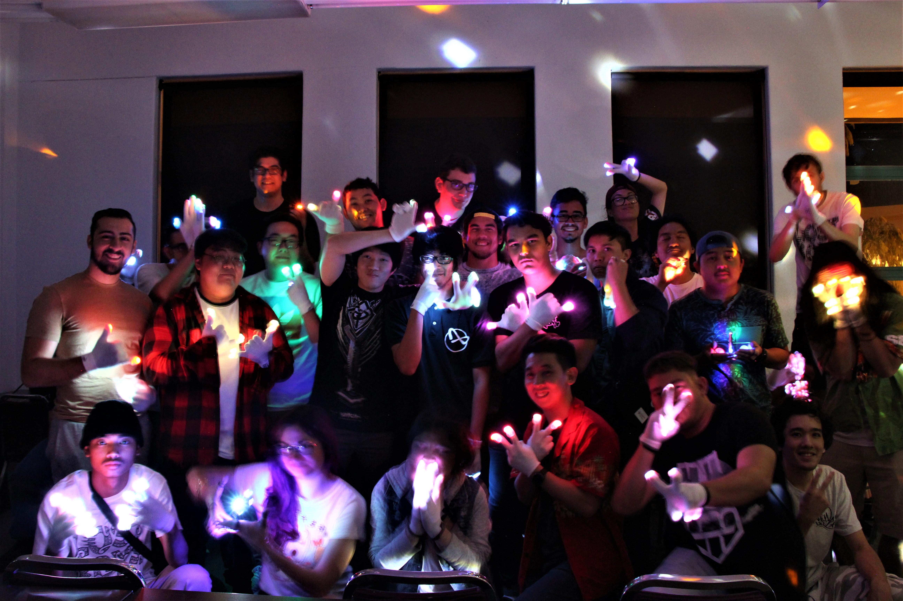

# Our Goal
To provide a safe place to foster the growth of different flow art styles such as gloving, orbiting, hooping, poi, etc.  We hope to provide a venue for UH Manoa students to practice their art, compete, and hold events.  If you do any flow arts or are interested in learning about one, please consider joining the AlohaNation Flowarts RIO at UH Manoa!

## Contact Info
President & Main Point of Contact Email: onakan@hawaii.edu

Facebook Group: [https://www.facebook.com/groups/anfclub](https://www.facebook.com/groups/anfclub)

UH Manoa RIO List: [GoogleSheet](https://docs.google.com/spreadsheets/d/1vK_ixq3a86uXjHXy9oNnyYHwAvyU9smNPKuJU6OYd-Q/edit#gid=864157507)

                                            _Featured: Smiley, Professor_
                                            
**[Officers](officers.md)****[Flowart Resources](flowresources.md)****[Constitution](constitution.md)**     
                                           

